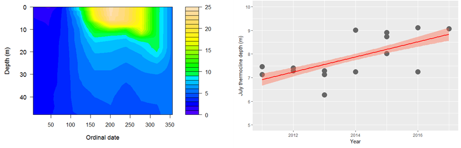

# Plotting and graphics {#Chapter4}



<p style="font-family: times, serif; font-size:.9em; font-style:italic">
Sweet graphs, right? Want to learn how to make them? Okay, but baby steps here, alright?.</p>

<br>

In this Chapter we will walk through plotting in R, both with the base graphic utilities that come with R, and the `ggplot2()` package from the `tidyverse` that has taken over the world (er, revolutionized how we write R code). Both of these are actually great to work with for different reasons. The base graphics are built-in, powerful, and give you 100% full control over your graphic environment. The `ggplot2()` library (and a million packages that people have written to work with it) takes these to a new level in terms of functionality and 95% of the time it will do exactly what you need. That other 5% of the time it is really great to be able to fall back on the base graphics.

For the examples in this chapter, we'll work with the water quality data contained in `physical.csv`. You will need to download the class data sets that go with this book to play along if you have not already (click [here](https://danstich.github.io/stich/classes/BIOL217/software.html) for instructions from the course website).

We will walk through histograms, scatter plots, line graphs, and boxplots in base graphics and `ggplot2` in this Chapter. Later in the book, we will add examples of how to plot predictions from statistical models alongside raw data using these same tools.

If you installed the `tidyverse` successfully in [Chapter 3](#tidyverse), then you can load all the packages we'll need by including `library(tidyverse)` at the start of your script:

```{r, eval = TRUE, message= FALSE}
# Chapter 4 Lecture module

# Package load
library(tidyverse) 

# 4.2 Plotting with base R ----
# ...

```


## Plots matter as much as stats
Before we get started:

1. There are few statistical tests that hold intuitive meaning to our readers. The ability to present information in a visually meaningful way to the reader can help to make the interpretation of your science crystal clear without having to worry about whether or not your reader has the faculties to interpret the results of some fancy statistical test that *you* think is cool.

2. Effects and effect sizes are often (if not always) more important than the ability to detect 'significant' differences.  If you can present clear evidence that some treatment or manipulation confers a biologically meaningful change in a visual way alongside these tests, you can provide a much stronger body of evidence with which to argue your case.

3. There are a few graphical tools that are very useful for basic data exploration, diagnostics, etc., that can make your life a lot easier for data analysis and interpretation. They can also help you decide whether something has gone terribly wrong.

The takeaway here is: *don't make shitty graphs*.

## Plotting with base R {#base-graphics}
Let's look at a few simple types of plots in R. The default graphics in R are not much to look at. But, there are a **ton** of ways to modify these plots, and the user (that's you!) can build plots from the ground up if needed. 

One of the great things about base graphics is that many of the plot types take the same, or similar arguments that are all based on shared graphical parameters.

You can access the help file for these shared graphical parameters by running `?pars` in the console. We will use many of these in the sections that follow.

### Histograms {#histograms}
Let's start with the histogram function that we began playing with at the end of [Chapter 3](#stochastic). 

The `hist()` function plots a histogram but it actually does a whole lot more than just that. Like other plotting utilities, it can take a wide variety of arguments and it actually does some basic data analysis behind the scenes. All of the arguments are optional or have default values with the exception of the data that we want to plot (a numeric variable). This is the case for most plotting functions in the base graphics for R.
 
Start by reading in the data contained within the `physical.csv` file from the class data folder. Remember, I am assuming that your code is inside of a folder that also contains your class data folder that you named [`data`](https://danstich.github.io/stich/classes/BIOL217/software.html).

```{r} 
# I added stringsAsFactors = FALSE to read in all
# text strings as `chr`.
 otsego <- read.csv("data/physical.csv", stringsAsFactors = FALSE)
```
 
These are data collected each year from Otsego Lake by students, staff, and faculty at the SUNY Oneonta Biological Field Station in Cooperstown, NY, USA. The data set includes temperature (&deg;C), pH, dissolved oxygen, and specific conductance measurements from a period of about 40 years. There are all kinds of cool spatial and seasonal patterns in the data that we can look at. We will use `temperature` for the examples that follow.

Make a histogram of temperature across all depths and dates just to see what we are working with here:
```{r}
hist(otsego$temp)
```

The default histogram in base graphics leaves much to be desired. Thankfully, it is easy to modify the look of these figures. For example, we can add labels to the x and y-axis using `xlab` and `ylab`, and we can give the histogram a meaningful title by adding `main = ...` to the `hist()` call or remove it completely by saying `main = ""`.
```{r}
hist(otsego$temp, xlab = "Temperature", ylab = "Frequency", main="")
```

We can make the axes cross at zero if we are concerned about that. We need to do this by specifying `yaxt = "n"`, `xaxt = "n"` in the `hist()` call and then follow up by telling R exactly where to start each of the axes. In this example, I also add some changes to the color of the bars (`col`) and the color of the borders (`border`). Finally, I fix the x- and y-axis scales so I know where they'll start.
```{r}
# Make the histogram
hist(otsego$temp,
     xlab = "Temperature",
     ylab = "Frequency",
     main = "",
     xaxt = "n",
     yaxt = "n",
     col = "gray87",
     border = "white",
     xlim = c(0, 30),
     ylim = c(0, 3500)
     )

# Add an x-axis going from zero to thirty degrees
# in increments of 2 degrees and start it at zero
axis(side = 1, at = seq(from = 0, to = 30, by = 2), pos = 0)

# Add a rotated y-axis with default scale and 
# start it at zero
axis(side = 2, las = 2, pos = 0)

```

**Colors!!!**

If `gray87` is not your style (whatevs), there are another 656 pre-named colors in R. You can see their names by running `colors()` in the console like this: 
```{r, eval = FALSE, echo = TRUE}
colors()
```

If you are a little more adventurous, you might try the `rgb()` color specification or hex values. I really like the `rgb()` specification because you can include an `alpha` channel to make your colors transparent (oooooh!). For example, if I change my code above to use the following:
```{r, eval = FALSE, echo = TRUE}
col = rgb(red = 0.90, green = 0, blue = 0.30, alpha = 0.10)
````

I get a transparent, purple histogram.

```{r, eval = TRUE, echo = FALSE}
# Make the histogram
hist(otsego$temp,
     xlab = "Temperature",
     ylab = "Frequency",
     main = "",
     xaxt = "n",
     yaxt = "n",
     col = rgb(red = 0.30, green = 0, blue = 0.90, alpha = 0.10),
     border = "white",
     xlim = c(0, 30),
     ylim = c(0, 3500)
     )

# Add an x-axis going from zero to thirty degrees
# in increments of 2 degrees and start it at zero
axis(side = 1, at = seq(from = 0, to = 30, by = 2), pos = 0)

# Add a rotated y-axis with default scale and 
# start it at zero
axis(side = 2, las = 2, pos = 0)
```

So purply.

There are tons of great blogs and eBooks with whole chapters devoted to colors and color palletes in R. There are even whole packages we'll work with dedicated to colors. By all means, check them out! We will work with a few as we continue to increase complexity.

### Scatterplots {#scatterplots}
Scatter plots are a great starting point for doing exploratory data analysis or for displaying raw data along with summary graphics. They are also the default behavior for the `plot()` function for continuous variables in base R.

Let's demonstrate by by plotting surface temperature (`depth` = 0.1 m) by month across years. We'll use the data management skills we picked up in [Chapter 3](#Chapter 3) to filter the data first.

```{r}
# Filter to get July surface temperatures
surface <- otsego %>% filter(depth == 0.1)

# Default scatter plot
plot(x = surface$month, y = surface$temp)

```

As with the `hist()` function, the default here is underwhelming. We can use many of the same arguments that we specified in `hist()` to dress this up a bit. This time, we will specify a plotting character `pch` that corresponds to a filled circle. Then, we tell R to give it an `rgb()` background (`bg`) with no color for lines that go around each point. That way the data points are darker where there is overlap between them. Finally, we use `expression()` to include the degree symbol in the y-axis label.

```{r}
# Better scatter plot
plot(x = surface$month, 
     y = surface$temp,
     pch = 21,
     bg = rgb(0, 0, 0, 0.2),
     col = NA,
     xlab = "Month",
     ylab = expression(paste("Temperature ( ", degree, "C)"))
     )

```

This is a lot more informative because it shows us where most of the observations fall within a given month, and how much variability there is. But, it would be nice to have some summary.

### Lines {#lines}
We can plot lines in a few different ways in the base graphics of R. We can create stand-alone line graphs with data in R pretty easily with the `plot()` function we used for scatter plots in the preceding section.

For example, let's say that we want to just plot average surface temperature in each month as a line graph. We can summarize the data quickly and then plot those:
```{r, message = FALSE}
mids <- surface %>%
  group_by(month) %>%
  summarize(avg = mean(temp))

plot(mids$month, mids$avg, type = "l", xlab = "Month", ylab = "Average")

```

We could even add these to the scatter plot of our raw data using the `lines()` function. Play around with `lty` and `lwd` to see if you can figure out what they do. If you get stuck, don't forget to Google it! (Worst Stats Text eveR.)
```{r}
# Same scatter plot
plot(x = surface$month, 
     y = surface$temp,
     pch = 21,
     bg = rgb(0, 0, 0, 0.2),
     col = NA,
     xlab = "Month",
     ylab = expression(paste("Temperature ( ", degree, "C)"))
     )
# Add a thick, dotted line that is gray (this is a gray40 job)
lines(mids$month, mids$avg, lty = 3, lwd = 2, col = "gray40")
```

We could also add the means to the main plot with `points()` and choose a different size or color than the raw data. We'll look at these options and more as we step up complexity.

For raw data like these, though, we are better off using a box plot to show those types of summaries.

### Boxplots {#boxplots}
The basic box plot is straightforward to create, but can be a real pain to modify because the syntax is slightly different from the other plotting functions we've worked with so far.

Let's try to summarize surface temperature by month using a box plot to see how these work in the base R graphics. Notice that we are specifying the variables as a formula here, and explicitly telling R what the data set is:
```{r}
boxplot(temp~month, data = surface,
        xlab = "Month",
        ylab = expression(paste("Surface temperature ( ", degree, "C)")))
```

Wow, that was waaaaay to easy! Have you ever tried to make one of those in Excel? Forget about it. It would take you half a day, and then when you realized you forgot ten data points you would have to do it all again.

But, it is still much ugly. Maybe there is a way we can change that?

Of course there is!

Let's add a little color and tweak some options. For a full set of optional arguments you can change, run `?bxp` in the console. (Ooh, that one is sneaky:  `bxp()` is the function inside of `boxplot()` that actually draws the plots).

Options are named consistently by the part of the plot. For example, `boxwex`, `boxcol` and `boxfill` all control the look of the box. Likewise, the options `boxcol`, `whiskcol` and `staplecol` control the colors of the box, whiskers, and staples, respectively. Nifty, right? Play with the settings below to see what each one does. Then, go explore some more options.It is the easiest way to learn when you are learning from The Worst Stats Text eveR.
```{r}
boxplot(temp~month, 
        data = surface,
        xlab = "Month",
        ylab = expression(paste("Surface temperature ( ", degree, "C)")),      
        border = "gray40",
        boxwex = 0.50, boxcol = "gray40", boxfill = "gray87",
        whisklty = 1, whisklwd=1, whiskcol = "gray40",
        staplewex = 0, staplecol = NA,
        outpch = 21, outbg = "gray90", outcol = "gray90"
        )
```

Finally, we can combine this with a scatter plot to `jitter` our raw data over the top of the boxes in each month:
```{r}
boxplot(temp~month, 
        data = surface,
        xlab = "Month",
        ylab = expression(paste("Surface temperature ( ", degree, "C)")),      
        border = "gray40",
        boxwex = 0.50, boxcol = "gray40", boxfill = "gray87",
        whisklty = 1, whisklwd=1, whiskcol = "gray40",
        staplewex = 0, staplecol = NA,
        outpch = 21, outbg = NA, outcol = NA
        )
points(jitter(surface$month), surface$temp, cex=.4, pch=19, col=rgb(0,0,0,0.2))

```


That is actually starting to look pretty snazzy! We'll continue to work to improve our base graphics as we move forward. For now, let's have a look at how to do these things in `ggplot2` next.


## Plotting with `ggplot2`
Plotting with [`ggplot2`](https://ggplot2.tidyverse.org/) and the dozens of packages that use it is a bit different than plotting with base graphics in R. Part of the reason for this is that it uses a work flow that is similar to the data manipulation we have looked at so far. In general, you could think of this as creating a canvas, applying some routine aesthetics based on the data structure (e.g. grouping), and then adding layers on to the canvas like we did with [base graphics](#base-graphics).

It takes a little getting used to, but you'll see how powerful it can be for multifaceted plots when we get to later chapters. We'll walk through the same plots that we did in [base graphics](#base-graphics), but this time we'll use the `ggplot()` function and layer on the pieces.


### Histograms {#gghists}
The default histogram is easy to create with `ggplot()` and a geometry layer. We start with the `ggplot` call, and then add the histogram geometry, `geom_histogram()`, like this. I usually save the plot to an object with an arbitrary name I don't use for anything, like `p` or `s` or `v`, and then print it explicitly.

```{r}
# Histogram of water temperature across 
# all dates and depths
p <- ggplot(otsego, aes(x=temp)) + geom_histogram(bins=30)

print(p)

```

Right away this looks a lot prettier than the default histogram that we produced with base graphics. Of course, we can customize just like we did before.

Let's add labels for the x and y-axis next:
```{r}
# Histogram of water temperature across 
# all dates and depths
p <- ggplot(otsego, aes(x=temp)) + 
  geom_histogram(bins=30) + 
  xlab(expression(paste("Temperature (", degree, "C)"))) +
  ylab("Count")

print(p)
```

We can also scale the `x-axis` and the `y-axis` like we did in the base graphics example {#histograms}.
```{r, message = FALSE, warning = FALSE}
# Histogram of water temperature across 
# all dates and depths
p <- ggplot(otsego, aes(x=temp)) + 
  geom_histogram(bins=30) + 
  xlab(expression(paste("Temperature (", degree, "C)"))) +
  ylab("Count") +
  scale_x_continuous(limits=c(0, 25), expand = c(0, 0)) + 
  scale_y_continuous(expand = c(0, 0))
print(p)
```

We can modify each of other layers individually, all at once using preset ggplot [themes](http://www.sthda.com/english/wiki/ggplot2-title-main-axis-and-legend-titles) or by modifying a pre-defined theme.

Let's have a look at how a theme changes the appearance. I am going to add `theme_bw()` here, but check out the others linked above. I also add a few adjust the position of the x- and y-axis labels and removed the panel grid in the `theme()` function after applying a theme. 
```{r, message = FALSE, warning = FALSE}
# Histogram of water temperature across 
# all dates and depths
p <- ggplot(otsego, aes(x=temp)) + 
  geom_histogram(bins=30) + 
  scale_x_continuous(limits=c(0, 25), expand = c(0, 0)) + 
  scale_y_continuous(expand = c(0, 0)) + 
  xlab(expression(paste("Temperature (", degree, "C)"))) +
  ylab("Count") +
  theme_bw() +
  theme(
    axis.title.x = element_text(vjust = -1),
    axis.title.y = element_text(vjust = 3),
    panel.grid = element_blank()
  )
print(p)
```

Spend some time practicing this and changing options to see what you can come up with. Be sure to check out the descriptions of the options you can pass to theme by running `?theme` to get the help file.

### Scatter plots {#ggscatter}
Now that we have a basic feel for the `ggplot2` work flow, changing plot types is really easy because all of the parts of our plots work together in the same way.

As a reminder, we previously built scatter plots of surface temperature in Otsego Lake, NY by month using base graphics.

Go ahead and subset the data again:
```{r}
surface <- otsego %>% filter(depth == 0.10)
```

Now, we can make the default scatterplot:
```{r}
s <- ggplot(surface, aes(x = month, y = temp)) +
  geom_point()
print(s)
```

At a glance, this already looks a lot nicer than the default scatterplots from base graphics, but we still have a lot of work to do. Plus, we get ggplots own odd behaviors when it comes to the x-axis scale and titles. So, let's get to work!

First, we'll replace the default axis titles and add the `theme_bw()` that we used above, with the same modifications to axis positions and grid lines.
```{r}
s <- ggplot(surface, aes(x = month, y = temp)) +
  geom_point() + 
  xlab("Month") +
  ylab(expression(paste("Temperature ( ", degree, "C)"))) +
  theme_bw() +
  theme(axis.title.x = element_text(vjust = -1),
        axis.title.y = element_text(vjust = 3),
        panel.grid = element_blank()
  )
print(s)
```

Okay, now we need to fix that pesky x-axis scale to use whole months or text labels. 

To fix the axis scales, we've actually got to do a little bit of work this time. In this case the easiest thing to do is probably to make a categorical variable out of the column `month`, which is an integer. We can do this using some fancy indexing with the built-in object that contains month abbreviations, `month.abb` in base R.
```{r}
surface$c_month <- factor(month.abb[surface$month], levels=month.abb)
```

Whoa, that was a heavy lift (sarcasm). Let's see how that changes the appearance of our plot:

```{r}
s <- ggplot(surface, aes(x = c_month, y = temp)) +
  geom_point() + 
  xlab("Month") +
  ylab(expression(paste("Temperature ( ", degree, "C)"))) +
  theme_bw() +
  theme(axis.title.x = element_text(vjust = -1),
        axis.title.y = element_text(vjust = 3),
        panel.grid = element_blank()
  )
print(s)
```
This is starting to look really nice. 

Finally, we just add a little transparency to the points by specifying `alpha = 0.2` inside of `geom_point()` and we are good to go!
```{r}
s <- ggplot(surface, aes(x = c_month, y = temp)) +
  geom_point(alpha = 0.2) + 
  xlab("Month") +
  ylab(expression(paste("Temperature ( ", degree, "C)"))) +
  theme_bw() +
  theme(axis.title.x = element_text(vjust = -1),
        axis.title.y = element_text(vjust = 3),
        panel.grid = element_blank()
  )
print(s)
```

Looks just like the one we made with base graphics!

### Lines {#gglines}
Most of the time we plot line graphs, whether in base graphics or using `ggplot2`, we are going to be adding them to existing plots. This was really straightforward in base graphics. It is only slightly more complicated in `ggplot2`.

We'll start with the default line graph, and then add it to the scatter plot from the previous section.

Let's calculate monthly means of surface temperature in Otsego Lake again:
```{r, message = FALSE}
mids <- surface %>%
  group_by(month) %>%
  summarize(avg = mean(temp))

```

Now plot it with `ggplot()`:

```{r}
lp <- ggplot(mids, aes(x = month, y = avg)) +
  geom_line()

print(lp)
```

There you have it!

Now, we just need to add this to our scatterplot that we made previously. To do this, we have to insert `geom_line()` in the code, but we must specify
```{r}
s <- ggplot(data = surface, mapping = aes(x = c_month, y = temp)) +
  geom_point(alpha = 0.20) + 
  geom_line(mapping = aes(x = month, y = avg),
            data = mids,
            color = 'gray40',
            lty = 3,
            lwd = 1) +
  xlab("Month") +
  ylab(expression(paste("Temperature ( ", degree, "C)"))) +
  theme_bw() +
  theme(axis.title.x = element_text(vjust = -1),
        axis.title.y = element_text(vjust = 3),
        panel.grid = element_blank()
  )

print(s)
```

We will continue to use this approach throughout the book to plot raw data and model predictions. So, if it is giving you trouble now, spend some extra time with it.

### Boxplots and violins {#ggboxplots}
To wrap up our tour of plotting examples in `ggplot2`, we will reproduce (more or less) the box plots we made in [base graphics](#boxplots).

Make the default box plot of surface water temperatures in Otsego Lake, NY. Notice that we use the `c_month` variable that we made previously in the `surface` data so R knows these are groups.
```{r}
bp <- ggplot(surface, aes(x = c_month, y = temp)) + geom_boxplot()

print(bp)
```

If we add changes we made to previous plots here, then we can get a cleaner look:
```{r}
bp <- ggplot(surface, aes(x = c_month, y = temp)) +
  geom_boxplot(color = 'gray40', fill = 'gray87', width = 0.3) +
  xlab("Month") +
  ylab(expression(paste("Temperature ( ", degree, "C)"))) +
  theme_bw() +
  theme(axis.title.x = element_text(vjust = -1),
        axis.title.y = element_text(vjust = 3),
        panel.grid = element_blank()
  )

print(bp)
```

And, of course, we can add our "jittered", raw data points over the top to show the spread.
```{r}
bp <- ggplot(surface, aes(x = c_month, y = temp)) +
  geom_boxplot(color = 'gray40', fill = 'gray87', width = 0.4) +
  geom_jitter(size = .5, width = 0.1) +
  xlab("Month") +
  ylab(expression(paste("Temperature ( ", degree, "C)"))) +
  theme_bw() +
  theme(axis.title.x = element_text(vjust = -1),
        axis.title.y = element_text(vjust = 3),
        panel.grid = element_blank()
  )

print(bp)
```

## Next steps

Hopefully this chapter provided you with a basic overview of plotting in R. If you struggled with these exercises, practice them again, or check out some [additional online resources](https://danstich.github.io/stich/classes/BIOL217/resources.html). In the coming chapters, we will continue to add functionality and complexity to how we use these kinds of plots. We'll look at how to compare two groups within a single plot in [Chapter 6](#Chapter6) when we dive into sampling distributions. And, eventually we will learn how to plot predictions from our statistical model against observed data from Chapter 8 onward.

