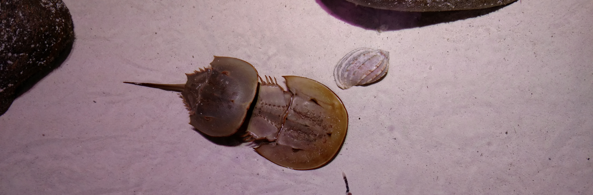

# GLM: Count models {#Chapter13}



<p style="font-family: times, serif; font-size:.9em; font-style:italic">
The majestic female horseshoe crab. Once she has one mate she might attract any number of other "satellite" males. How many? Let's find out, but first we'll need a good count model. </p>

## Introduction {#intro13}

This week we continue our exploration of generalized linear models and their implementation and interpretation in R. We will continue to investigate the flexible formulation of GLM for use with count models. By the end of this week, you should have a reasonable understanding of why we might use different kinds of count models, how to use them, and what the results mean. We will dive back into the world of residual diagnostics again this week to look at a few different tools that we have at our disposal for GLM.

We'll keep working with the `tidyverse` this week. But, we'll also check out some utilities from the `MASS` and `boot`, packages to demonstrate new techniques. You'll probably need to install `boot` before you can load it, but we've worked with the others already. Go ahead and load them all when you're ready.

```{r warning = FALSE, message = FALSE}
library(tidyverse) # For all the good stuff in life
library(boot) # For inv.logit() function
library(MASS) # For negative.binomial family in glm()
```

## Poisson regression {#poisson-13}
Poisson regression is useful for situations in which we have a response (independent variable) that is a count. These are discrete data that cannot be considered continuous because it is impossible for them to take on non-integer or non-negative values. Common examples of these types of responses include species count data in ecology, cell or colony counts in biology, and the number of respondents or patients reporting a side-effect or symptom of interest in health care studies.

For the Poisson family, the link function that we will use is the "log" link function. This one is exactly what it sounds like. This link function allows us to work with data that are constrained to be non-negative, a desirable property when we are working with count data.

Let's use the `crab` data set to demonstrate the GLM with Poisson data. We will walk through this data set for both the Poisson and negative binomial examples, addressing some distributional assumptions and model fit along the way.

```{r, echo=FALSE}
# Read in the data. These data also are available through
# the glm2 package in R.
crabs <- read.csv("data/crabs.csv", header = TRUE)

# Have a look-see
head(crabs)
str(crabs)
```


### Data explanation {#data-13}
These data represent the number of satellite male horseshoe crabs per female (rows) in relation to a number of characteristics of the females. Here, our response of interest is `satellites` and the female characteristics are our explanatory (independent) variables. These include female color, spine condition, carapace width, and mass (g).

The full citation for the paper on which this data set is based is here:

H. J. Brockmann. 1996. Satellite male groups in horseshoe crabs, *Limulus polyphemus*. Ethology 102:1-21. [doi:10.1111/j.1439-0310.1996.tb01099.x](https://onlinelibrary.wiley.com/doi/abs/10.1111/j.1439-0310.1996.tb01099.x)

We are going to convert color to a `factor` to start because it is currently stored as a numeric variable.
```{r}
# We want to convert color to
# a factor right off the bat
crabs$color <- as.factor(crabs$color)
```

Next, we'll fit a "full" model that assumes the number of `satellites` is a function of width, mass, spine condition, and color.
```{r}
# Fit a model
count_mod <- glm(
  satellites ~ width + mass + spine + color,
  data = crabs,
  family = "poisson"(link = log)
)
```

Before we go any further, let's have a quick look at the model diagnostics using the methods we applied to linear models in [Chapter 9](#Chapter9). Right away, we can see that this model is not a very good fit to the data.

```{r}
ggplot(count_mod, aes(x = .fitted, y = .resid)) +
  geom_jitter() +
  xlab("Fitted values") +
  ylab(expression(paste(epsilon)))
```

This brings us to the next important point we need to make about GLMS...

> Even though we are relaxing the assumptions of linear models, we still need to check to make sure the models we use are valid with respect to our assumptions.

This will become considerably more complicated as we begin to move into distributions other than the binomial and the Poisson, as our standard methods become less and less applicable and in-depth model validation becomes more obscure and more involved (but more important!).

So, what is going on here? At this point a few things should jump out at you from this plot. First, there is some kind of trend happening at the bottom of our plot where the residuals slant downward from left to right. That's something that should scream "not good!" at you, even if you don't know why. Second, this plot doesn't really make it look like our residuals are symmetrically distributed with a mean of zero. But, it is really hard to tell from this graph, especially because of the weird patterns at the bottom of the scatter plot.

We can check this second concern using a histogram if we want to see if it "looks normal" like this:

```{r}
ggplot(count_mod, aes(x = .resid)) +
  geom_histogram(bins = 25) +
  xlab(expression(paste(epsilon)))
```


Now that we see it presented this way, it is pretty clear that our residuals are not symmetrically distributed around zero even if the mean is about zero. We could also calculate some descriptive statistics for the residuals to really nail this down.

```{r}
mean(count_mod$residuals)
```

Hmmm...the mean is fairly close to zero here, but we've already talked about the fact that the mean isn't a very good descriptive statistic for distributions that we suspect or know are not normal. What about the median as a measure of central tendency?

```{r}
median(count_mod$residuals)
```

Wow, okay, that is a bit more negative than the mean, and at this point we may start to question whether we can say that the residuals are normally distributed with a mean of zero. If we are uncomfortable coming right out and saying that the residuals are not normal, we could always use a Shapiro-Wilk normality test to check (see [Chapter 6](#Chapter6) if you've forgotten what this one is).

```{r}
shapiro.test(count_mod$residuals)
```

Remember that the null hypothesis here is that the sampling distribution of our residuals is normal, so a `p-value` of < 0.05 tells us to reject the null and now our residuals are officially not normal! Crap, wasn't the whole point of using GLM supposed to be so we could keep meeting this assumption?

So, why has this happened to us? Recall that the Poisson distribution is controlled by a single parameter, $\lambda$, that is both the mean and the variance of the distribution. If we had started by doing data exploration we would have, of course, noticed that even though the data represent counts, they are pretty clearly over-dispersed (variance is much larger than mean) and are indicative of a negative binomial sampling distribution.

For now, we won't bother to look at these results from this model because the link function is the same, so we can get the results from the negative binomial regression in the same way. Plus, if our model is in violation of assumptions then the results will be unreliable anyway.


## Negative binomial regression {#negbin}
Okay, moving on with life, let's take a look at the negative binomial regression model as an alternative to Poisson regression. Truthfully, this is usually where I start these days, and then I might consider backing down to use of Poisson if all assumptions are actually verified (but, **this has literally never happened for me**).

We will start this time by actually doing some data exploration before our analysis. This is really how we should have started above, but that would have ruined all the fun.

First, look at the distribution of the data. Here, it should be pretty obvious to you by now that these are count data for which the mean is not equal to the variance...right?
```{r}
hist(crabs$satellites)
```    

If you think back to a couple of weeks ago, you'll remember this is a pretty typical example of the negative binomial distribution.

We can take a look at how this shakes out between our groups (`color`) as well.
```{r}
boxplot(satellites ~ color, data = crabs, boxwex = 0.3)
```

And, you can see here that even within groups the distributions do not look like they are normal or like they have equal variances, so we will fit a GLM that assumes the response is drawn from a negative binomial distribution. 

For this example, we will use a function called `glm.nb`. This function allows us to estimate a GLM for lets us estimate parameters for a GLM that uses the negative binomial error distribution and estimates the "overdispersion parameter" for the negative binomial distribution. You, of course, remember this parameter and know it as `theta` or `size` from our discussions about sampling distributions.

We can fit it with the GLM function like this as long as we have the `Mass` package loaded:

```{r}
neg_mod <- glm(satellites ~ width + mass + color,
  data = crabs,
  family = "negative.binomial"(theta = 1)
)
```

Play around with the two formulations above and see if there's a difference. *Clue*: there's not, really. Just two different ways to do the same thing. The functionality in the `glm` function only came around recently, that's all.

Now, let's take a look at the distribution of the residuals. I am going to work with the object I fit using the `glm()` function. This time, we'll split our residuals out by `color` group so we can see where the problems are

```{r}
ggplot(neg_mod, aes(x = color, y = .resid, fill = factor(color))) +
  geom_violin(alpha = 0.1, trim = FALSE) +
  geom_jitter(aes(color = factor(color)), width = .1) +
  xlab("Fitted values") +
  ylab(expression(paste(epsilon)))
```

Now we are starting to look a lot more "normal" within groups, and we are getting more symmetrical in our residual sampling distributions. If we had to move forward with this model we could probably do so with a straight face at this point. However, it looks like most of the area of each violin above is below zero (so the mean of our residuals is also negative and non-zero), so we may have some issues going on here that could make this model bad for prediction.

**But**, how does this compare to the Poisson model for count data? We can use model selection to compare the Poisson model to the negative binomial model, since the response is the same in both cases.
```{r}
AIC(count_mod, neg_mod)
```

Clearly the negative binomial model is far superior to the Poisson model here. Now, with a reasonable model in hand we could proceed with data visualization, but we might also rather have a "good" model to work with instead of just one that is "good enough". It turns out that the really problem behind the weirdness in our residuals is actually due to an excess number of zero counts of `satellite` males on a lot of our females. This is actually really common in count data, where we might observe a lot of zeros before actually counting a success. And, once we have one success (e.g. a parasite infection or illness), we often have extreme events with lots of successes. For example, it might take a while to find a fish with a parasite, or a human with a specific illness, but then that individual could have dozens or hundreds of parasites, or the illness might pop up in a cluster of hundreds of individuals in one location depending on the intensity of the infection. For these cases, we'll need to deal with the issue these excessive zeros ("zero inflation") directly.


## Zero inflation {#zinf-13}

The fits of these two models, in reality, suggest the need to for what is becoming an increasingly common statistical tool: the zero inflated count model. Zero inflation (excess zeroes in count data) can arise by one of two mechanisms: true ("process") zeros and observational zeros that result from imperfect detection.

One approach to dealing with this is to use a **hurdle model**. The idea is to make two separate models: 1) a logistic regression model to help us determine which factors influence whether the phenomenon of interest even occurred (0 or 1), and 2) a count model to help us determine what factors influence with the frequency of occurrence given that it occurred in the first place. 

When these models are linked mathematically, we call it a "mixture model" - an approach that has become very popular for accounting for imperfect detection when estimating abundance of organisms. For now, let's just look at the hurdle model for our crab data as the n-mixture approach falls solidly in the realm of "advanced" methods we'll not discuss in this book.

First, we need to make a binary indicator variable to represent whether or not any satellites were present:

```{r}
# Make a new column for count
# and absence (of satellite males)
# and initialize to zero
crabs$present <- 0

# Assign a '1' if any satellites were
# observed
crabs$present[crabs$satellites > 0] <- 1
```

Now, the first step in the hurdle model is to fit a logistic regression model to predict how our response is affected by some combination of explanatory variables.

```{r}
step1 <- glm(present ~ mass, data = crabs, family = "binomial")
summary(step1)
```  

Here we see that mass has a significant effect on whether or not *any* satellite males are present. You could imagine fitting any number of plausible biological models for comparison using AIC at this point.

Step 2 is to fit a count model to explain the effects of some combination of explanatory variables on the frequency with which the phenomenon occurs given that it ever occurred in the first place. **Note**: This does not have to be the same combination of explanatory variables. In fact, it is always conceivable that different processes influence these two distinct phenomena. As with the count-absence model, you could even fit a candidate set of models and proceed with model comparisons using AIC.

```{r}
# Make a model relating the number
# of satellite males to the mass
# of female crabs
step2 <- glm(
  satellites ~ mass,
  data = crabs[crabs$satellites != 0, ],
  family = "negative.binomial"(theta = 1)
)

# Print a summary of the model
summary(step2)
```

From these results, we can see that our count models in the previous sections were really just picking up on the large number of zeroes in our data set. We know this because of the differences in the results between the models `step1` and `step2`. 

Likewise, we can take another look at our model diagnostics for `step2` to see if our diagnostic plots look more reasonable now.

```{r}
ggplot(step2, aes(x = .fitted, y = .resid)) +
  geom_jitter() +
  xlab("Fitted values") +
  ylab(expression(paste(epsilon)))
```

Here, we can see that our residual plots indicate a pretty drastic improvement.

### Predictions {#predict-13}

Now that we are finally happy with our residual plots (wow, that took a lot longer than fitting any of the models!) we can make a plot of our predictions against the raw data to see how we did.

Let's start with the count/absence component that we fit in `step1`:

Make some predictions from the model using a sequence of new values of `mass` based on what we observed in our data set:
```{r}
# Sequences of new masses based on the min and max observed
# in our data
new_mass <- data.frame(mass = seq(min(crabs$mass), max(crabs$mass), .1))

# Make predictions using step1 model and the new_mass df
count_preds <- data.frame(
  predict(step1, newdata = new_mass, type = "link", se.fit = TRUE)
)

# Get 95% confidence intervals
count_preds$lwr <- count_preds$fit + count_preds$se.fit * qnorm(0.025)
count_preds$upr <- count_preds$fit + count_preds$se.fit * qnorm(0.975)

# Invert the logit-link function
count_preds <- apply(count_preds, 2, boot::inv.logit)

# Combine the new masses and the predictions with which
# they are associated
pres_preds <- data.frame(new_mass, count_preds)
```

**Important:** Our hurdle model actually contains two models (`step1` and `step2`). The `step1` component is actually **logistic regression** and therefore uses the **logit** link function that we introduced in [Chapter 12](#Chapter12), so we need to invert the logit to get the probability of a female having any `satellite` males as a function of `mass`. This is done in the code above. Make sure you understand how and why we do this!

Once you've got that down, it's all over but the plotting. Here is how predicted probability of `satellite` male crab count changes across the range of observed female `mass`:

```{r}
ggplot(pres_preds, aes(x = mass, y = fit)) +
  geom_line() +
  geom_ribbon(aes(ymin = lwr, ymax = upr, color = NULL), alpha = .3) +
  scale_y_continuous(limits = c(0, 1)) +
  xlab("Mass of female crab (g)") +
  ylab("Probability of satellite male")
```

Finally, we can make a plot of the number of `satellite` males we would expect to see on a female crab given that she had attracted any males in the first place.

**Also important:** We need to remember here that we have two different models. The first model `step1` was a binary logistic regression, so it used the logit link. The second model `step2` was a count model and used the log link. That means we need to invert the log link to get our predicted counts back on the real scale.

```{r}
# Sequences of new masses based on the min and max observed
# in our data
new_mass <- data.frame(mass = seq(min(crabs$mass), max(crabs$mass), .1))

# Make predictions using step2 model and the new_mass df
count_preds <- data.frame(
  predict(step2, newdata = new_mass, type = "link", se.fit = TRUE)
)

# Get 95% confidence intervals
count_preds$lwr <- count_preds$fit + count_preds$se.fit * qnorm(0.025)
count_preds$upr <- count_preds$fit + count_preds$se.fit * qnorm(0.975)

# Invert the log link function
count_preds <- apply(count_preds, 2, exp)

# Combine the new masses and the predictions with which
# they are associated - overwriting on the fly - yuck!!
count_preds <- data.frame(new_mass, count_preds)
```


Here is a plot showing how the number of `satellite` males observed changes with the `mass` of female horseshoe crabs:

```{r}
ggplot(count_preds, aes(x = mass, y = fit)) +
  geom_line() +
  geom_jitter(aes(x = mass, y = satellites), data = crabs[crabs$satellites > 0, ]) +
  geom_ribbon(aes(ymin = lwr, ymax = upr, color = NULL), alpha = .3) +
  xlab("Mass of female crab (kg)") +
  ylab("Number of satellite males")
```

Well, it doesn't exactly inspire great confidence in the biological relationship between female horseshoe crab mass and the number of satellite males she attracts, but that is exactly why it is so important to communicate these effects

## Next steps {#next-13}

This chapter has provided an overview of GLMs that we can use for count data, and demonstrates one way to handle cases of skewed counts or (more extreme case) zero-inflated counts. These are common "problems" in biological and ecological data that are easily resolved within the flexible framework of GLM, which includes all of the other models we've looked at since [Chapter 6](#Chapter6). In [Chapter 14](#Chapter14) and [Chapter 15](#Chapter15) we'll look at how to extend this framework even further (another umbrella) to include repeated observations and relatedness between groups when we introduce mixed effects models.
